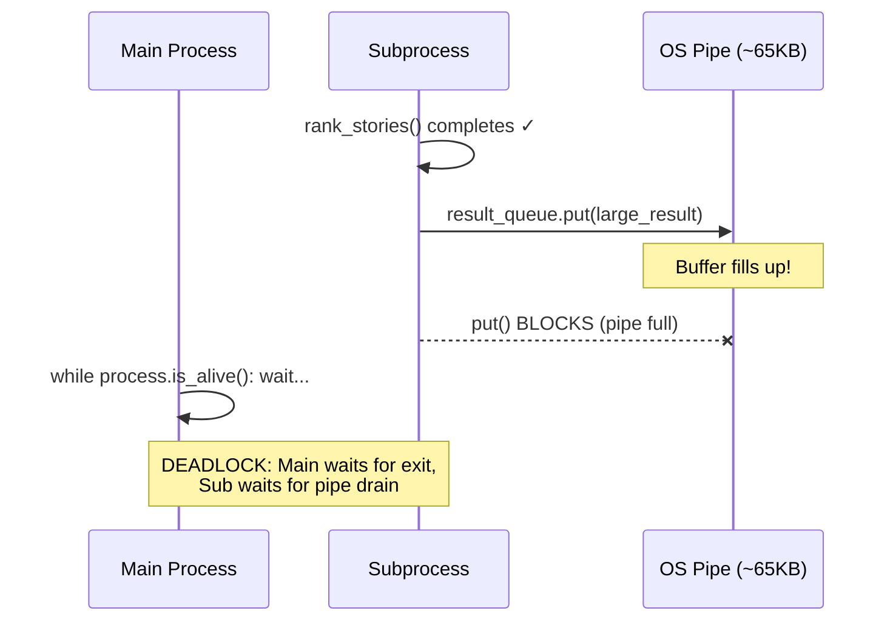

# ProcessQueue Deadlock Fix — Session Summary

## Root Cause Found & Fixed

The `ProcessQueue` in osiiso was deadlocking on Windows due to a **pipe buffer exhaustion** in `multiprocessing.Queue`.

### The Deadlock Mechanism



The old `_run_with_controls()` only called `result_queue.get()` **after** the process exited. But when the serialized result exceeded the OS pipe buffer (~65KB on Windows), `result_queue.put()` in the subprocess blocked waiting for the consumer to drain the pipe — creating a deadlock.

### The Fix (in osiiso)

**File**: [processqueue.py](file:///c:/Users/Samuel%20Ichinga/PycharmProjects/task_queue/src/osiiso/processqueue.py#L672-L745)

Poll `result_queue.get_nowait()` on every iteration of the `while process.is_alive()` loop, so the pipe is drained promptly while the subprocess runs.

```diff
- while process.is_alive():
-     process.join(timeout=self._poll)
- # Only read result AFTER process exits — DEADLOCK if result > pipe buffer
- kind, payload = result_queue.get(timeout=self._poll)

+ while True:
+     # Try to drain result (non-blocking) on every poll
+     if result is _SENTINEL:
+         try:
+             result = result_queue.get_nowait()
+         except queue_mod.Empty:
+             pass
+     alive = process.is_alive()
+     if result is not _SENTINEL and not alive:
+         break
+     process.join(timeout=self._poll)
```

Also added `_no_main_reimport()` to prevent unnecessary `__main__` re-import in spawned subprocesses.

## Commits

| Repo | Commit | Description |
|------|--------|-------------|
| `task_queue` (osiiso) | `bbc6510` | `fix: resolve ProcessQueue pipe deadlock on Windows` |
| `hn_crawler` | `3211938` | `Complete osiiso tutorial: AsyncQueue, ThreadQueue, ProcessQueue demos` |

## End-to-End Test Results

| Script | Status | Duration | Tasks |
|--------|--------|----------|-------|
| `async_crawler.py` (Part 1) | ✅ PASSED | 3.77s | 40/40 succeeded |
| `thread_crawler.py` (Part 2) | ✅ PASSED | 28.30s | 40/40 succeeded |
| `process_analyzer.py` (Part 3) | ✅ PASSED | 0.22s | 1/1 succeeded |

## How the Bug Was Diagnosed

1. **Monitor thread** showed the subprocess was alive (pid visible) but never exited
2. **File-based tracing** in `_invoke` revealed `_invoke done, result type=list` — the task completed but the subprocess stayed alive
3. This proved the hang was in `result_queue.put()`, not in task execution or module reimport
4. Classic Windows pipe buffer deadlock — well-documented in Python's own multiprocessing docs

> [!WARNING]
> This bug affects **any** ProcessQueue task returning a result larger than ~65KB when serialized. It's platform-dependent (pipe buffer size varies) but most reliably reproduces on Windows.
